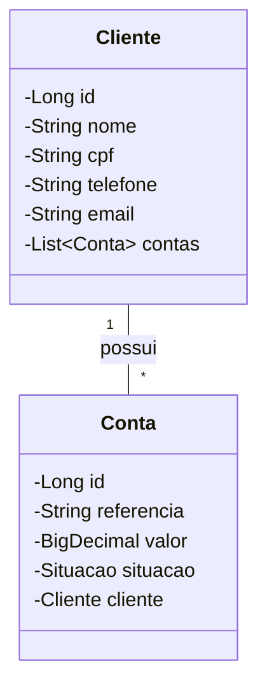

# Desafio Técnico - Sistema de Gerenciamento de Clientes e Contas

## 📝 Introdução
Este projeto foi desenvolvido como parte de um desafio técnico, demonstrando a implementação de um sistema de gerenciamento de clientes e suas respectivas contas utilizando boas práticas de desenvolvimento e arquitetura REST.

## 🛠️ Tecnologias Utilizadas
- Java 17
- Spring Boot 3.5.0
- PostgreSQL (Banco de Dados)
- Maven (Gerenciador de Dependências)

### 📦 Dependências Maven
- Spring Boot Starter Web
- Spring Boot Starter Data JPA
- Spring Boot Starter Validation
- PostgreSQL Driver
- Lombok
- SpringDoc OpenAPI (Swagger)
- Spring Boot Starter Test

## 🔍 Detalhes do Projeto
O projeto implementa um sistema de gerenciamento onde é possível cadastrar clientes e associar contas a eles. Cada cliente possui informações básicas como nome, CPF, telefone e email, enquanto as contas possuem referência temporal, valor e situação (PENDENTE, PAGA ou CANCELADA).

O sistema utiliza validações para garantir a integridade dos dados, como formato de CPF, email e telefone. A arquitetura segue o padrão MVC com camadas bem definidas (Controller, Service, Repository) e utiliza DTOs para transferência de dados.

## 📂 Estrutura do Projeto
```
src/
├── main/
│   ├── java/
│   │   └── com/
│   │       └── desafio/
│   │           └── dev/
│   │               ├── 🎮 controller/
│   │               ├── 📝 dtos/
│   │               ├── ⚡ ENUMS/
│   │               ├── ⚠️ exceptions/
│   │               ├── 📊 model/
│   │               ├── 💾 repository/
│   │               ├── 🔧 service/
│   │               └── 🚀 DevApplication.java
│   └── resources/
│       └── 📄 application.properties
└── test/
    └── java/
        ├──repository_test
        ├──validations_test
        └── 🧪 DevApplicationTests.java
```

## 📊 Diagrama de Classes


## 🔌 Endpoints Disponíveis

### Clientes
- **POST** `/clientes` - Criar novo cliente
- **GET** `/clientes` - Listar todos os clientes
- **PUT** `/clientes/{id}` - Atualizar cliente
- **DELETE** `/clientes/{id}` - Excluir cliente

## 🚀 Como Usar

1. **Pré-requisitos**
   - Java 17 instalado
   - PostgreSQL instalado e configurado
   - Maven instalado

2. **Configuração do Banco de Dados**
   - Crie um banco de dados PostgreSQL chamado 'desafio'
   - Atualize as configurações em `application.properties` se necessário

3. **Executando o Projeto**
   ```bash
   # Clone o repositório
   git clone https://github.com/cleybson7/projetoAvaliativo.git

   # Entre na pasta do projeto
   cd dev

   # Execute o projeto
   mvn spring-boot:run
   ```

4. **Acessando a Documentação**
   - Swagger UI: http://localhost:8080/swagger-ui.html

## 📝 Observações
- A aplicação foi completamente testada utilizando Postman para testes de integração
- Testes unitários foram implementados utilizando JUnit
- Documentação completa da API disponível via Swagger
- Código documentado seguindo padrões JavaDoc
- Interface intuitiva do Swagger para teste e compreensão dos endpoints